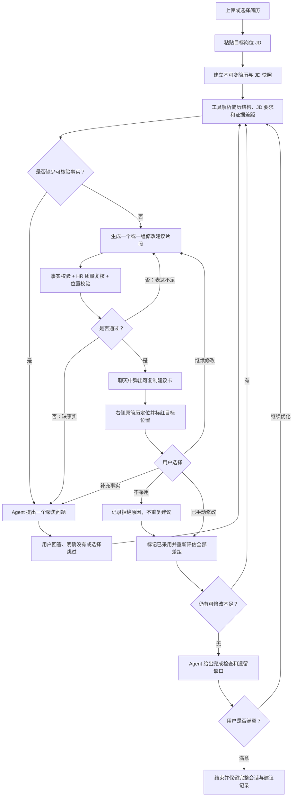

# InternPath 简历优化 Agent 对话式改造方案

> 文档日期：2026-07-10
> 改造对象：简历定向优化 Agent
> 核心目标：彻底放弃“自动生成并下载修改后简历”，改为“持续对话、证据问答、逐段建议、一键复制、原文定位、用户手动修改”

## 1. 最终决策

当前“整份重写 → 自动回写 DOCX/PDF → 下载投递版”的产品方向应停止继续投入。格式错乱不是单纯的 Prompt 问题，而是现有实现先把 PDF/DOCX 拍平成纯文本，再重组段落，最后通过模糊文本匹配回写 Word 所导致的结构性问题。

新版本必须遵守以下决策：

1. 新建的简历 Agent 会话不再生成 MD、DOCX、PDF 下载文件。
2. Agent 不直接修改用户原简历，只生成可核验、可复制的“建议片段”。
3. 每个建议片段必须绑定原简历中的稳定位置，并在前端将目标原文标红，明确提示“替换这里”。
4. Agent 可以多轮向用户追问事实、职责、技术选择和结果数据，得到答案后继续修改。
5. 每次修改都必须经过事实校验和质量复核；不足时继续提问或修订。
6. Agent 不能自行宣布任务结束。只有用户点击“我满意了，结束本次优化”后，会话才算完成。
7. 旧版已经生成的文件可以暂时保留只读下载能力，但不能再创建新的下载型任务。

目标产品不再是“替用户造一份新简历”，而是“陪用户把原简历逐段改好”。

## 2. 用户理想流程



默认一次只处理一个高优先级问题，避免一次输出十几段文字让用户无从下手。允许 Agent 一次询问最多三个强相关的小问题，但不得把整场访谈一次性压给用户。

## 3. 当前方案对用户的主要坏处

### 3.1 P0：产品完成目标与用户真实需求相反

当前工具循环把“至少替换一个段落并成功生成产物”作为完成条件：

- `backend/agents/tool_loop.py:394-478`
- `backend/agents/langgraph_orchestrator.py:515-571`

前端完成后首先提供整份 Markdown 复制和 MD/DOCX/PDF 下载：

- `frontend/src/pages/AgentResumePage.tsx:2292-2298`
- `backend/main.py:3912-4011`

用户真正需要的是理解差距、补充事实、逐条决定是否采用，而当前系统默认模型已经替用户做完了所有决定。

### 3.2 P0：格式错乱是结构性缺陷，不是提示词缺陷

当前解析链会：

1. 从 PDF/DOCX 中只抽取纯文本。
2. 清洗、合并行并重新识别标题。
3. 按段落重新拼接 `assembled_resume.txt`。
4. 用去空白后的文本和相似度窗口寻找 Word 段落。
5. 清空原 run，再把新文本写回；行数变多时克隆段落。

关键位置：

- `backend/resume_rag.py:219-251,369-408`
- `backend/agents/tools/resume_section_tools.py:194-290`
- `backend/agents/tools/docx_tools.py:782-823,825-904`

这条链路无法可靠保留复杂表格、文本框、多栏布局、项目符号层级、局部字体、行距、分页、图标和照片位置。继续修补自动下载只会不断增加边界条件。

PDF 原件转可编辑 DOCX 还依赖 Windows Microsoft Word COM（`backend/agents/tools/docx_tools.py:396-477`），与 Linux 生产部署天然不一致，也进一步说明该能力不应继续作为新 Agent 的成功条件。

### 3.3 P0：现在的“对话”并不是真正的持续对话

任务只有进入 `WAITING_FOR_HUMAN` 后，用户回答才会恢复 LangGraph。任务处于 `PENDING`、`RUNNING` 或 `COMPLETED` 时，普通消息大多只是记录到数据库；用户追问“为什么这样改”时，后端返回本地模板解释，并没有重新调用 Agent 和工具：

- `backend/main.py:3673-3743`
- `backend/main.py:3794-3821`
- `backend/main.py:3852-3887`

因此当前页面虽然有输入框和消息记录，但不是“用户每发一条消息，Agent 就带着上下文继续工作”的聊天产品。

### 3.4 P0：完成条件没有“用户满意”这一关

当前只要出现一次成功的 `replace_resume_section` 和一次成功的 `finalize_resume_artifacts`，工具循环就允许完成：

- `backend/agents/tool_loop.py:446-452`

LangGraph 随后直接进入 `finalize_task` 并将状态写成 `COMPLETED`：

- `backend/agents/langgraph_orchestrator.py:469-473,560-571`

这不能表达“还要再改短一点”“这一段我不采用”“请继续找不足”“我现在满意了”等真实用户决策。

### 3.5 P0：前端把 JD 错当成候选人事实证据

`buildFactLedger()` 会把新增数字或技术词只要也出现在 JD 中，就判断为 `verified`：

- `frontend/src/utils/agentInsights.ts:165-182`

页面又把该结果展示为“已验证”：

- `frontend/src/pages/AgentResumePage.tsx:2358-2378`

JD 只能证明企业需要什么，不能证明用户做过什么。这会给用户制造“模型已经核验过”的错误安全感，必须从新流程中删除。

### 3.6 P0：没有可靠的原简历位置

当前修改记录只有 `section_name`、`section_index`、`original`、`new` 和 `reason`：

- `frontend/src/pages/AgentResumePage.tsx:69-75`
- `backend/agents/tools/resume_section_tools.py:269-276`

段落识别只保存粗粒度行号和段落索引：

- `backend/agents/tools/resume_section_tools.py:194-232`

它不能稳定回答：

- 原文在第几页；
- 是哪个项目的第几条；
- 位于正文、表格单元格还是文本框；
- 用户重新上传修改版后这个位置是否仍有效；
- 同样原文出现两次时到底应替换哪一处。

因此现有 Diff 只能告诉用户“这段变了”，不能可靠告诉用户“去原简历的这里粘贴”。

### 3.7 P0：同一功能存在两套不兼容的前端流程

独立 `AgentResumePage` 支持 `WAITING_FOR_HUMAN`，但 `ResultPage` 也会调用同一个优化接口。`ResultPage` 没有回答界面，轮询又只把 `COMPLETED` 和 `FAILED` 当终态：

- `frontend/src/pages/ResultPage.tsx:314-413`
- `frontend/src/pages/ResultPage.tsx:377-385`

后端默认 `is_co_pilot=true`：

- `backend/main.py:216-245`

旧结果页一旦遇到人工追问，可能永远停在“优化中”。两套入口也让用户无法形成稳定心智。

### 3.8 P0：用户上传同名修改版简历时可能仍使用旧内容

上传接口会先按文件名查找，只要同名就直接返回旧解析结果，甚至不会读取新文件字节：

- `backend/main.py:1626-1654`

这对手动改简历的新方案尤其致命。用户保存为相同文件名再上传，Agent 可能继续分析旧简历，并复用旧任务结果。

### 3.9 P1：Agent 工具过少，而且以“修改文件”为中心

当前模型可见工具主要是工作区读写、段落替换、生成 Diff、询问用户和最终生成文件：

- `backend/agents/tool_registry.py:347-418`

缺少以下产品必需能力：

- 结构化解析 JD；
- 查询已有岗位分析；
- 检索具体简历证据；
- 查询用户已确认事实；
- 创建版本化建议而非直接覆盖；
- 校验每个新增声明的证据；
- 评价建议质量；
- 判断还有哪些不足未处理；
- 处理接受、拒绝和继续修订。

`write_workspace_file` 还是一个过宽的模型可见写工具，不应继续出现在顾问模式中。

### 3.10 P1：界面让普通用户承担工程配置

新建任务时用户需要理解：

- 自动 / 对话；
- 流水线 / Agentic；
- JSON / 原生工具调用；
- 模型配置；
- 缓存命中、token、SSE、工具日志。

相关界面集中在：

- `frontend/src/pages/AgentResumePage.tsx:2632-2778`

用户只想“针对这个 JD 改好简历”。模型和工具调用模式应由系统配置，详细日志只能放在默认收起的高级诊断区域。

### 3.11 P1：建议没有接受、拒绝和版本语义

`ResumeDiffView` 只有展示，没有逐条复制、接受、拒绝、恢复、反馈或版本操作：

- `frontend/src/components/resume/ResumeDiffView.tsx:202-235`

`ResultPage` 虽然可以双击编辑，但模型修改已经默认生效，也没有“保留原文”和“让 Agent 再改一版”的正式状态：

- `frontend/src/pages/ResultPage.tsx:620-820`

### 3.12 P1：页面中的部分“智能结果”是前端字符串拼装

所谓简历 A/B 版本、网申话术、事实账本和行动包，有相当一部分只是截取前几行、匹配关键词和字符串模板：

- `frontend/src/utils/agentInsights.ts:219-281,315-384`

这些内容会进一步增加信息噪声，并可能让用户复制到不应出现的位置。新 Agent 主线应删除这些非证据化输出。

### 3.13 P1：默认 Agentic 路径绕过了项目已有的专业质量模块

当前 RQ 默认进入通用 LangGraph 工具循环，实际依赖的是一段通用英文提示和少量文件工具：

- `backend/agents/tool_loop.py:394-430`
- `backend/jobs.py:282-325`

默认路径没有真正串联已有的 `AgentPlanner`、`JobDecoder`、`ResumeCopywriter`、`HRCritic`、本地事实守门和 AI Service 质量模块。用户在页面上看到的是“Agentic 高级模式”，但结果并没有经过这些专业模块的完整检查。新框架应把它们包装为可测试工具，而不是继续作为未接入的存量代码存在。

当前简历优化 Agent 也没有经过 AI Service 的结构化 RAG、引用和质量门禁。后续接入时必须限制证据来源，不能让 JD 或普通知识库文本反向“证明”候选人经历。

### 3.14 P1：工具失败与任务成功语义不可靠

当前部分工具即使底层返回“错误：文件不存在”或写入失败，外层仍可能包装成 `ok: true`；`requires_confirmation` 和 `timeout_seconds` 也主要停留在元数据层：

- `backend/agents/tool_registry.py:124-189,283-343`

在线保存接口还会先把任务写成 `COMPLETED`，再尝试更新 DOCX/PDF；后续异常被捕获后仍返回成功文案：

- `backend/main.py:4113-4152`

这会让用户看到“完成”或“同步成功”，实际文件却不完整。新工具框架必须让工具结果、业务状态和用户提示保持一致。

## 4. 新产品的核心交互

### 4.1 唯一入口

只保留一个“简历定向优化”会话页。

- 侧栏和首页进入该页面。
- 岗位分析结果页不再自动弹出“生成投递版简历”。
- 结果页只保留“与简历 Agent 讨论”按钮，并携带 `resumeId`、`jdText` 和可选 `analysisId` 进入同一页面。
- 所有历史会话均从统一会话列表恢复。

### 4.2 页面布局

```text
┌──────────────┬──────────────────────────────────┬──────────────────────────┐
│ 会话列表       │ 连续聊天记录                       │ 原简历定位 / 当前建议         │
│ 公司 + 岗位    │ Agent 分析、问题、用户回答、建议卡   │ 第 1 页 / 项目经历 / 第 2 条  │
│ 简历版本       │                                  │ 红色高亮：请替换这里           │
│ 最后消息       │ [输入消息........................] │ 修改前 / 修改后 / 证据         │
└──────────────┴──────────────────────────────────┴──────────────────────────┘
```

移动端改为单栏聊天，原简历定位和建议详情使用底部抽屉。不得继续强行保留三栏或横向滚动。

### 4.3 新建会话只保留三个输入

1. 选择或上传简历。
2. 粘贴 JD。
3. 点击“开始分析”。

模型选择使用设置中的默认模型。工程模式、工具协议和缓存策略只放在管理员或高级设置中。

### 4.4 Agent 问题卡

每个问题必须包含：

- 为什么需要这个信息；
- 它会影响简历的哪一段；
- 用户可以提供什么类型的证据；
- “我没有这项经历”和“跳过”按钮；
- 是否保存为长期事实或偏好的显式选项，默认不保存。

示例：

> JD 强调接口性能优化。你在 InternPath 项目中是否实际测量过响应时间、吞吐量或并发量？如果没有，请直接选择“没有数据”，Agent 会改成不带数字的稳健表达。

用户选择“没有”后，系统应记录为禁止添加项，不得在后续轮次再次虚构或重复追问同一个事实。

### 4.5 修改建议卡

每张卡必须是一个独立、可版本化的建议，而不是整份简历的一部分隐式覆盖。

```ts
interface ResumeSuggestion {
  id: string;
  sessionId: string;
  version: number;
  parentSuggestionId?: string;

  target: {
    blockId: string;
    sectionId: string;
    sectionName: string;
    itemLabel?: string;
    sourceFormat: "pdf" | "docx" | "txt";
    pageNumber?: number;
    locationLabel: string;
    locatorConfidence: "exact" | "high" | "approximate";
    bbox?: [number, number, number, number];
  };

  priority: "high" | "medium" | "low";
  issue: string;
  originalText: string;
  proposedText: string;
  copyText: string;
  rationale: string;
  expectedImpact: string;

  jdRequirementIds: string[];
  resumeEvidenceBlockIds: string[];
  userFactIds: string[];
  factStatus: "supported" | "needs_user" | "unsupported";
  factIssues: string[];

  status: "proposed" | "accepted" | "needs_revision" | "rejected" | "applied";
}
```

建议卡操作：

- 复制修改后文字；
- 查看原简历依据；
- 查看对应 JD 要求；
- 为什么这样改；
- 改短一点；
- 更克制；
- 在真实证据允许时更量化；
- 补充事实；
- 保留原文；
- 标记“我已粘贴”；
- 继续让 Agent 检查其他不足。

`copyText` 必须是纯文本，不包含 Markdown 标题、代码围栏、解释文字或“优化后如下”等前后缀。

### 4.6 原简历位置标红

用户点选一张建议卡时，右侧原简历视图必须自动滚动到对应 `blockId`：

- 目标原文使用红色边框和浅红背景；
- 同时显示“替换这里”文字和定位图标，不能只依赖颜色；
- 上下文前后各显示一到两条，帮助用户在 Word 中找到位置；
- 顶部显示类似“第 1 页 > 项目经历 > InternPath 项目 > 第 2 条”的定位路径；
- 如果位置只是近似匹配，必须明确显示“位置为近似定位”，不能伪装成精确结果。

PDF 可以直接在页面图像上叠加红框。DOCX 只用于渲染原文件预览和建立位置映射，不再用于生成修改后文件。

## 5. 简历结构与位置映射

当前 `cleanedText + chunks` 只适合 RAG，不足以支持精确粘贴位置。解析结果需要新增 `blocks`，并保存在不可变简历版本中。

```ts
interface ResumeBlock {
  id: string;
  order: number;
  kind: "heading" | "paragraph" | "bullet" | "table_cell" | "textbox";
  sectionId: string;
  sectionName: string;
  itemLabel?: string;
  text: string;
  textHash: string;
  contextBefore?: string;
  contextAfter?: string;
  locator: {
    sourceFormat: "pdf" | "docx" | "txt";
    pageNumber?: number;
    bbox?: [number, number, number, number];
    paragraphIndex?: number;
    tablePath?: number[];
    textboxIndex?: number;
    lineStart?: number;
    lineEnd?: number;
  };
}
```

实现策略：

- PDF：增加 PyMuPDF 之类支持坐标的解析器，提取 page、block 和 bbox，同时生成页面预览。
- DOCX：读取正文、表格、页眉页脚和文本框的 OOXML 顺序；将原 DOCX 渲染为 PDF 后，用文本匹配补充页面和 bbox。
- TXT：使用行号和字符区间。
- 所有 block 使用内容哈希、顺序、上下文共同定位，不能只依赖 `section_index`。
- 重新上传新简历后，旧建议仍绑定旧版本；不得静默套用到新版本。
- 如果目标 block 的 `textHash` 已变化，建议标记为过期，要求重新分析。

## 6. Agent 工具框架改造

### 6.1 不推翻现有框架，增加工具配置档案

保留现有工具注册、Responses function calling、LangGraph、RQ 和 checkpoint 基础，但把完成规则和可见工具从硬编码改成配置档案：

- `artifact_legacy`：只服务旧历史任务，保留原文件生成工具。
- `resume_advisor`：新默认模式，只允许读取、分析、追加事实、创建建议和状态转换。

`resume_advisor` 中必须禁止模型调用：

- `write_workspace_file`
- `replace_resume_section`
- `finalize_resume_artifacts`
- DOCX/PDF 导出工具

### 6.2 工具定义需要升级

当前手写 `_validate_args()` 只校验少量顶层类型。新工具应使用 Pydantic v2 输入/输出模型，并统一包含：

- `name` 和 `version`；
- 输入模型和输出模型；
- `side_effect`: `read | append | transition`；
- 超时和重试策略；
- 幂等键生成规则；
- 是否需要用户确认；
- 由运行时真正执行用户确认和超时，而不是只保存元数据；
- 允许使用的工具配置档案；
- 脱敏日志策略；
- 标准错误码和是否可重试。

工具执行结果统一为：

```json
{
  "ok": true,
  "data": {},
  "error": null,
  "meta": {
    "tool": "verify_suggestion_facts",
    "version": "1.0.0",
    "traceId": "...",
    "durationMs": 42,
    "evidenceRefs": []
  }
}
```

模型不应获得任意数据库或文件写权限。所有写入只能通过领域明确的 append/transition 工具完成。

### 6.3 新默认工具清单

| 工具 | 作用 | 副作用 | 可复用现有模块 |
| --- | --- | --- | --- |
| `get_resume_snapshot` | 读取当前会话绑定的不可变简历版本、hash 和基础信息 | read | `database.py` 简历存储 |
| `get_resume_outline` | 返回 section、block、上下文和稳定定位 | read | `backend/resume_rag.py`，需扩展 blocks |
| `locate_resume_blocks` | 返回页面、bbox 和定位置信度 | read | `layout_tools.py`，新增位置适配器 |
| `get_analysis_context` | 读取已有岗位分析、硬约束和建议，避免重复分析 | read | `analysis_records.result_json` |
| `parse_jd_requirements` | 将 JD 拆成 must-have、nice-to-have、职责和关键词 | read | `backend/agents/job_decoder.py` |
| `retrieve_resume_evidence` | 针对某条 JD 要求检索简历 block/chunk 证据 | read | `backend/resume_rag.py` 或 AI Service RAG |
| `list_confirmed_facts` | 查询原简历事实、用户已确认事实和明确否认项 | read | conversation state + 新事实账本 |
| `list_resume_preferences` | 查询用户已明确保存的写作偏好 | read | `PreferenceDB` |
| `analyze_gap_queue` | 生成可改写、需补证据、不可通过改写解决的差距队列 | read | 现有 background analyzer 结构 |
| `draft_resume_suggestion` | 针对单个 block 生成结构化建议 | append | `ResumeCopywriter`，改为结构化输出 |
| `verify_suggestion_facts` | 校验所有新增数字、日期、机构、技能、角色和结果 | read | `check_resume_fact_integrity`，需增强 |
| `review_suggestion_quality` | 评价相关性、清晰度、长度、重复和 ATS 表达 | read | `HRCritic` |
| `revise_resume_suggestion` | 根据用户反馈或质量报告创建新版本 | append | `ResumeCopywriter` retry |
| `record_user_fact` | 追加用户确认事实或明确否认项，保留来源消息 | append | 新事实账本 |
| `save_user_preference` | 仅在用户显式同意时保存长期偏好 | append | `PreferenceDB` |
| `request_user_input` | 创建结构化问题并暂停本次 run | append | 现有 HITL/interrupt |
| `evaluate_session_completion` | 检查未解决差距、未验证建议和用户状态 | read | 新完成策略 |

“复制”是浏览器行为，不是 Agent 工具。

### 6.4 事实校验规则

每个新声明必须满足至少一个证据来源：

1. 原简历 block；
2. 用户在当前会话明确确认的回答；
3. 用户主动保存的长期事实；
4. 可信材料库中的可追溯证据。

以下内容绝不能作为候选人事实证据：

- JD 文本；
- 模型常识；
- “行业通常如此”；
- 仅在改写稿中第一次出现的内容。

发现不受支持的数字、年限、技术栈、公司、学校、职位、角色升级或结果时，工具必须返回 `needs_user` 或 `unsupported`，不能由模型自行合理化。

## 7. 新 LangGraph 工作流

新建独立的 `ResumeAdvisorGraph`，不要把聊天继续塞进当前生成文件的图中。

建议节点：

```text
load_session
  → refresh_context
  → analyze_gaps
  → choose_next_action
      ├─ request_user_input → interrupt
      ├─ draft_suggestion
      │    → verify_facts
      │    → review_quality
      │    → present_suggestion
      │    → wait_user_action
      ├─ explain_to_user
      └─ ready_for_confirmation
```

关键约束：

- 每条用户消息创建一个独立 run，由 RQ 执行到下一次需要用户输入或本轮输出完成。
- 会话长期保持 `ACTIVE`，不能把一次模型 run 的 `COMPLETED` 当成整个会话完成。
- 用户在任何状态发送普通消息，都必须触发真实 Agent run，而不是只写数据库或返回静态模板。
- `interrupt()` 只负责当前问题暂停；用户回答后用 `Command(resume=...)` 恢复。
- Agent 产生建议后应暂停等待用户接受、拒绝或要求修订，而不是自动继续批量覆盖全部段落。
- 同一 `question_key` 在用户已回答“没有”或“跳过”后不得重复询问，除非上下文发生实质变化。
- Agent 判断已无可改进项时，只能进入 `READY_FOR_CONFIRMATION`，仍需用户确认满意。

### 7.1 会话状态与 run 状态分离

会话状态：

- `ACTIVE`
- `WAITING_FOR_USER`
- `READY_FOR_CONFIRMATION`
- `SATISFIED`
- `ARCHIVED`
- `FAILED`

单次 run 状态：

- `QUEUED`
- `RUNNING`
- `PAUSED`
- `COMPLETED`
- `FAILED`

## 8. 后端模块与接口

### 8.1 建议模块结构

```text
backend/resume_advisor/
  __init__.py
  router.py
  schemas.py
  repository.py
  session_module.py
  graph.py
  completion_policy.py
  events.py
  tools/
    registry.py
    resume_context.py
    jd_context.py
    evidence.py
    suggestion.py
    verification.py
    interaction.py
    location.py
```

`backend/main.py` 只注册路由，不再继续堆叠大量简历 Agent 业务逻辑。

对调用方暴露一个较深、较小的模块接口：

```python
class ResumeAdvisorModule:
    async def start_session(...): ...
    async def post_message(...): ...
    async def review_suggestion(...): ...
    async def finish_session(...): ...
    def get_snapshot(...): ...
```

LangGraph、RQ、数据库表、工具调用和事件流都隐藏在该模块实现内部，前端和普通路由不需要了解执行细节。

### 8.2 新 HTTP 接口

| 方法 | 路径 | 用途 |
| --- | --- | --- |
| `POST` | `/api/agent/resume/sessions` | 创建对话式会话并绑定简历/JD 快照 |
| `GET` | `/api/agent/resume/sessions` | 分页获取会话列表 |
| `GET` | `/api/agent/resume/sessions/{id}` | 获取会话、当前 run、消息、建议和完成检查快照 |
| `POST` | `/api/agent/resume/sessions/{id}/messages` | 发送普通用户消息，每次都创建真实 run |
| `GET` | `/api/agent/resume/sessions/{id}/events?afterSequence=` | SSE 断线续传 |
| `GET` | `/api/agent/resume/sessions/{id}/resume-view` | 获取 outline、blocks 和页面预览信息 |
| `POST` | `/api/agent/resume/suggestions/{id}/actions` | 接受、拒绝、要求修订或标记已粘贴 |
| `POST` | `/api/agent/resume/sessions/{id}/finish` | 用户显式确认满意并结束 |
| `POST` | `/api/agent/resume/sessions/{id}/archive` | 归档会话 |

消息请求应包含 `clientMessageId`，并建立会话内唯一约束，避免双击或网络重试产生重复 run。

### 8.3 SSE 改造

当前 SSE 更像一次性任务流，到 `WAITING_FOR_HUMAN` 或 `COMPLETED` 就结束，也没有可续传事件 ID。新事件至少包含：

- `sequence`；
- `runId`；
- `type`；
- `messageId` 或 `suggestionId`；
- `createdAt`。

用户断线重连时使用 `afterSequence` 补发业务事件。工具内部日志只显示摘要，完整简历文本和完整工具参数不得写入遥测日志。

## 9. 数据模型改造

### 9.1 简历版本

现有 `resumes` 增加：

- `content_hash`
- `parent_resume_id`
- `version_no`
- `is_current`

上传流程必须先读取文件并计算 hash：

- 同名、同 hash：允许复用已有版本；
- 同名、不同 hash：必须创建新 `resume_id`；
- 新会话绑定明确的 `resume_id + content_hash`；
- 任务缓存键必须包含简历 hash 和 JD hash，不能只使用文件名或 resume id。

### 9.2 复用并扩展现有会话表

将 `agent_resume_tasks` 作为存储适配器继续复用，但在代码领域中称为 `ResumeAdvisorSession`。新增字段：

- `interaction_mode`: `artifact_legacy | resume_advisor`
- `analysis_record_id`
- `resume_content_hash`
- `jd_content_hash`
- `title`
- `session_status`
- `active_run_id`
- `last_message_at`
- `user_satisfied_at`
- `archived_at`

旧记录统一回填为 `artifact_legacy`。

### 9.3 扩展消息表

`agent_resume_turns` 新增：

- `sequence_no`
- `message_kind`: `text | question | suggestion | completion | error | tool_summary`
- `payload_json JSONB`
- `client_message_id`
- `run_id`
- `parent_turn_id`
- `status`

业务消息以 turns 为真相；`agent_resume_tasks.logs` 只保留脱敏运维信息。

### 9.4 新增 run 表

`agent_resume_runs`：

- `id`
- `session_id`
- `trigger_message_id`
- `status`
- `rq_job_id`
- `trace_id`
- `started_at`
- `finished_at`
- `error_code`
- `error_message`
- `telemetry_json`

它把“永久会话”和“一次后台执行”彻底分开。

### 9.5 新增建议表

`agent_resume_suggestions`：

- 建议 ID、会话 ID、版本、父建议 ID；
- 目标 block、原文 hash、位置 JSON；
- 原文、建议文本、纯复制文本；
- 问题、理由、预期影响、优先级；
- JD 要求引用、简历证据引用、用户事实引用；
- 事实校验状态与问题；
- 用户状态：proposed、accepted、needs_revision、rejected、applied；
- 创建 run、创建时间、更新时间。

### 9.6 新增事实账本

`agent_resume_facts`：

- `claim_key` 和 `claim_value`；
- `source_type`: `resume_block | user_message | saved_profile`；
- `source_id`；
- `status`: `confirmed | denied | uncertain`；
- `scope`: `session | resume | global`；
- 创建和更新时间。

事实账本不能再用前端字符串匹配临时构造。

## 10. Agent 行为规则

新 Agent 系统提示和完成策略必须明确：

1. 你的任务是协助用户手动修改原简历，不是生成文件。
2. 不得输出整份重写简历，除非用户明确要求仅在聊天中查看整合文本；即使如此也不生成下载。
3. 优先从高优先级、可通过表达改进的问题开始。
4. 没有证据时必须提问；用户没有相关经历时，诚实保留缺口。
5. JD 不属于用户事实证据。
6. 用户的疑问、偏好和事实回答必须区分；疑问不能自动写入事实账本。
7. 新增量化指标、年限、技术、组织、职位、主导角色和业务结果前必须有证据。
8. 每条建议必须返回原文位置、原文、建议文本、修改理由和证据引用。
9. 用户拒绝的建议不得重复出现，除非用户提供了新证据或主动要求重提。
10. 完成检查必须列出无法靠简历改写解决的真实缺口，不能为了“完全匹配 JD”而编造内容。
11. 只有用户显式确认满意，才能结束会话。

## 11. 前端改造方案

### 11.1 拆分巨型页面

当前 `AgentResumePage.tsx` 超过 2700 行，聊天、任务、日志、缓存、Offer、行动包和生成表单全部耦合。建议拆成：

```text
frontend/src/features/resumeAdvisor/
  api.ts
  types.ts
  copyText.ts
  useResumeAdvisorSession.ts
  SessionSidebar.tsx
  ConversationThread.tsx
  MessageComposer.tsx
  AgentQuestionCard.tsx
  ResumeSuggestionCard.tsx
  OriginalResumeViewer.tsx
  ResumeLocationHighlight.tsx
  EvidenceDrawer.tsx
  CompletionCheckCard.tsx
  AdvancedRunDrawer.tsx
```

页面只负责组合这些模块。

### 11.2 优先复用的前端资产

- `ResumeAdviceList.tsx`：已有优先级、问题、建议、示例、证据链和逐条复制，可作为建议卡基础。
- `types/analysis.ts` 中的 `ResumeAdvice`：比当前 `ModificationItem` 更接近新结构。
- `ResumeDiffView.tsx`：复用行级和词级 Diff 算法。
- `ResumeChunkPreview.tsx`：复用证据展开能力。
- `ResumeUpload.tsx`、`resumeService.ts`、`useResumeUpload.ts`：统一上传和历史简历选择。
- `AdminPage.tsx` 中已有的剪贴板降级逻辑：提取为公共 `copyText()`。
- Agent 页现有 SSE、轮询降级和历史列表逻辑：抽到 hook 后复用。

### 11.3 必须移出新主线的前端内容

- MD/DOCX/PDF 下载按钮；
- “生成投递版简历”自动弹窗；
- ResultPage 的 `/save` 原地回写流程；
- `agentInsights.ts` 的前端事实验证；
- 截取前几行伪造的简历版本；
- 关键词模板生成的网申话术；
- Offer 滑块和行动包；
- 默认展开的缓存、token、工具协议和运行日志。

### 11.4 复制体验

- `await navigator.clipboard.writeText()` 成功后才显示“已复制”。
- Clipboard API 不可用或拒绝时使用 textarea + `document.execCommand("copy")` 降级。
- 失败时在建议卡附近显示可恢复错误，不能写进新建任务表单的隐藏区域。
- 所有复制按钮支持键盘操作、明确焦点样式和 `aria-live` 成功提示。
- 可以提供“复制本条”和“复制所有已接受建议”，但不能复制未接受或未验证建议。

## 12. 复用与退役清单

### 12.1 继续复用

- Redis/RQ 后台执行；
- LangGraph PostgreSQL checkpointer；
- `Command(resume=...)` 和 HITL；
- Agent 工具注册和 Responses function calling；
- `agent_resume_turns`、conversation state、preferences；
- `JobDecoder`；
- 简历 RAG 和已有岗位分析结果；
- `check_resume_fact_integrity`，但需扩展为严格结构化结果；
- `HRCritic`；
- 现有结构化 `ResumeAdvice`；
- Diff、证据预览、上传和复制相关前端模块。

### 12.2 新会话中停止使用

- `write_workspace_file`
- `replace_resume_section`
- `finalize_resume_artifacts`
- `optimized_resume_md` 作为业务主结果
- 自动生成 `optimized_resume.docx/pdf`
- 新任务的 `/download`
- 新任务的 `/save`

### 12.3 兼容保留

旧 `artifact_legacy` 记录继续只读展示和下载，避免历史结果突然失效。新页面可以将其放入“旧版生成记录”分组，并明确标注“旧版文件产物”。

## 13. 分阶段实施顺序

### 阶段 0：立即止损

- 停止 ResultPage 自动弹出生成简历。
- 新入口隐藏 MD/DOCX/PDF 下载。
- 删除前端伪“事实已验证”展示。
- 修复同名文件直接复用旧内容的问题。
- Agent 任务缓存加入简历 hash 和 JD hash。
- 旧生成流程加 `artifact_legacy` 标记。

完成标志：用户不会再被主动引导下载错乱文件，也不会上传修改版却分析旧内容。

### 阶段 1：数据与简历定位基础

- 引入正式、可重复执行的 PostgreSQL migration。
- 扩展 resumes、tasks、turns。
- 新增 runs、suggestions、facts。
- 解析并保存 resume blocks。
- 实现 PDF/DOCX 原文件预览和位置置信度。

完成标志：任意建议都能稳定绑定一份不可变简历版本和一个目标 block。

### 阶段 2：Advisor 工具框架

- 工具注册器支持 profile。
- 使用 Pydantic v2 定义工具输入输出。
- 接入 JD、RAG、事实、质量和位置工具。
- 对模型隐藏任意写文件和导出工具。
- 新增脱敏、幂等、重试和统一错误处理。

完成标志：工具可以独立测试，并能产出带证据和定位的结构化建议。

### 阶段 3：ResumeAdvisorGraph 与对话接口

- 新建独立 graph。
- 分离 session 与 run。
- 所有用户消息触发真实 run。
- 建议后暂停等待用户动作。
- 支持接受、拒绝、修订、补事实和显式完成。
- SSE 支持 sequence 续传。

完成标志：刷新页面、断线、worker 重启后仍能继续同一轮对话。

### 阶段 4：新前端工作台

- 统一唯一入口。
- 中央聊天时间线。
- 结构化问题卡和建议卡。
- 原简历红色定位。
- 一键复制和降级复制。
- 移动端抽屉和无障碍支持。
- 高级运行信息默认收起。

完成标志：普通用户不需要理解 Agentic、JSON、原生工具、缓存或 token，也能完成全部流程。

### 阶段 5：旧链路退役与文档同步

- 停止创建 artifact task。
- 保留旧任务只读访问一段兼容期。
- 移除 ResultPage 旧优化代码和重复状态机。
- 评估是否最终删除 DOCX/PDF 自动生成代码及对应测试。
- 更新 `docs/agent-framework.md`、`docs/langgraph-migration.md`、README 和页面文案。

## 14. 测试方案

### 14.1 数据与版本

- 同名同内容文件可以复用。
- 同名不同内容必须创建新版本。
- 旧会话始终读取旧快照，新会话读取新版本。
- 简历被删除或更新后，已有会话仍能复盘其绑定快照。
- 不同用户无法读取对方的简历、消息、建议、事实或页面图像。
- migration 重复执行不报错，旧数据仍可读取。

### 14.2 Agent 与工具

- `resume_advisor` profile 中不存在文件写入、段落替换和导出工具。
- 越权调用旧写工具时明确拒绝。
- 每条建议都包含有效 block、JD requirement 和证据引用。
- JD 中出现的数字或技术词不能自动成为用户事实。
- 新增数字、日期、机构、技能或角色升级时，没有证据必须追问。
- 用户回答“没有”后，Agent 不再添加该声明，也不重复同一问题。
- 用户追问“为什么这样改”时会真实调用 Agent，而非静态模板。
- 建议修订创建新版本，不覆盖历史版本。
- 用户拒绝后不会在没有新上下文时重复建议。
- 没有用户确认时，状态不能进入 `SATISFIED`。

### 14.3 接口与并发

- 创建会话、发送消息、查看历史、建议动作和结束会话。
- 相同 `clientMessageId` 重试只创建一个 run。
- 同一会话同时发送两条消息时按 sequence 串行处理或明确拒绝冲突。
- 失败重试不重复写用户消息和建议。
- SSE 顺序为 accepted → progress/tool summary → assistant message/suggestion → run completed。
- 断线后能从 `afterSequence` 恢复。

### 14.4 前端

项目应增加 Vitest + React Testing Library，至少覆盖：

- 连续聊天和刷新恢复；
- 问题卡回答、没有、跳过；
- 建议卡接受、拒绝、修订和已粘贴；
- 复制内容与 `copyText` 完全一致；
- Clipboard API 失败时降级；
- 原简历自动滚动和红色定位；
- 近似定位明确提示；
- 流式断线、重试和错误就地显示；
- 新 advisor 会话完全不显示下载按钮；
- 旧 legacy 记录仍能只读下载；
- 375px 宽度下无横向滚动，关键操作支持键盘。

### 14.5 真实用户场景

至少准备以下固定回归样例：

1. DOCX 单栏普通简历。
2. DOCX 表格简历。
3. DOCX 文本框和双栏简历。
4. 可复制文本的 PDF。
5. 扫描型 PDF，定位降级为近似或 OCR。
6. 中英文混合简历。
7. 同一项目包含多个相似 bullet 的简历。
8. 用户没有 JD 要求经历，Agent 必须诚实保留缺口。
9. 用户补充真实量化数据后，建议成功升级。
10. 用户连续要求“改短一点 → 更具体 → 恢复上一版 → 满意结束”。

## 15. 验收标准

以下条件全部满足才算改造完成：

- [ ] 新会话不创建或展示任何修改后 MD/DOCX/PDF 下载。
- [ ] 用户只需选择简历、输入 JD 即可开始。
- [ ] 每条普通用户消息都会触发真实 Agent run。
- [ ] Agent 能根据证据缺口主动提问，并支持“没有”和“跳过”。
- [ ] 每条建议都有独立版本、状态、证据和原文位置。
- [ ] 每条建议都可一键复制纯文本。
- [ ] 前端能将原简历目标位置标红并说明粘贴位置。
- [ ] 无法精确定位时明确降级，绝不伪造精确位置。
- [ ] JD 不会被当作候选人事实证据。
- [ ] 用户可以接受、拒绝、继续修订和恢复历史版本。
- [ ] Agent 会循环重新检查不足，而不是一次生成后自动完成。
- [ ] 只有用户显式点击满意，整个会话才结束。
- [ ] 同名修改版简历不会复用旧内容或旧 Agent 结果。
- [ ] 刷新、断线和 worker 重启后会话可恢复。
- [ ] 新主界面不暴露流水线、Agentic、JSON、原生工具和缓存等工程概念。
- [ ] 旧下载型任务仍可只读访问，但系统不再创建新任务。

## 16. 最优先实现项

第一优先级不是继续改 DOCX 生成，也不是继续扩写 Prompt，而是完成以下垂直切片：

1. 修复简历版本与同名文件复用。
2. 新建 `resume_advisor` 工具配置档案，禁止所有产物写工具。
3. 让每条用户消息都创建真实 Agent run。
4. 生成一张带证据、可复制、可修订的建议卡。
5. 为该建议卡绑定一个稳定原文 block，并在前端标红定位。
6. 用户点击“已粘贴”后，Agent 继续检查下一处不足。
7. 用户点击“我满意了”后结束会话。

只要这条最小闭环跑通，产品价值就已经超过当前复杂但不可靠的整份简历下载方案。后续再增加批量建议、OCR 精确定位和更丰富的长期记忆。
