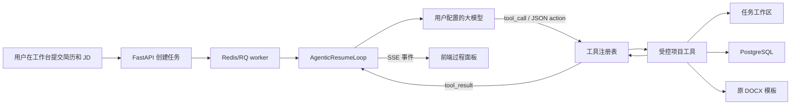

# InternPath Agentic Resume Optimization Plan

更新日期：2026-07-06

## 目标

把 InternPath 的简历优化从“后端固定流水线驱动”升级为“用户配置的大模型驱动工具执行”。用户选择的模型，例如 `gpt-5.5`，应该能在后端受控环境中直接调用项目专门准备的工具，完成读取简历、理解 JD、拆分段落、生成修改、写回 DOCX、事实核对、版面检查、询问用户、失败点重试和最终导出。

当前固定流水线不能删除。新能力必须以可回退方式接入，默认保持现有任务可用，再逐步把核心路径迁移到 Agentic Tool Loop。

## 不变原则

1. 不脑补接口。每个工具、字段、事件和模型参数都必须来自当前代码或明确新增的实现。
2. 不给模型任意文件、命令或数据库权限。模型只能调用白名单工具。
3. DOCX 是核心产物。禁止生成会丢失照片、文本框、分栏、页眉页脚或模板元素的兜底 DOCX 冒充成功。
4. Responses 模式选择后必须走 `/v1/responses`，并尽量保持 `stream=true`。
5. Prompt Cache 指的是大模型 provider 的缓存，不是本地任务复用。
6. 前端只允许工作区内部滚动：主过程、左侧栏、右侧栏各自容器滚动，页面外层不滚动。
7. 失败点必须可重试。重试要携带同一任务、同一工具名、同一参数、同一上下文，不允许变成空操作。
8. 云服务器可移植性必须作为验收条件：环境变量、依赖检查、日志路径、LibreOffice、Poppler、Redis、PostgreSQL 都要可部署。

## 最终工作流



## 阶段 0：现状固化与文档覆盖

### 要做

- 用本文覆盖旧 `优化.md` 全部内容。
- 把后续所有工作都按本文 checklist 执行。
- 每完成一块，在本文对应小节更新状态、证据和剩余风险。

### 验收

- `优化.md` 不再包含旧的乱码清单。
- 文档包含后端、前端、工具、DOCX、流式、Prompt Cache、测试、部署的完整路径。

## 阶段 1：工具注册表

### 目标

把散落在 `backend/agents/tools/*` 的函数收敛为模型可调用的白名单工具。工具注册表只暴露安全、确定、可审计的能力。

### 需要新增或修改的文件

- 新增 `backend/agents/tool_registry.py`
- 新增 `tests/test_agent_tool_registry.py`
- 可能修改 `backend/agents/tools/workspace_tools.py`
- 可能修改 `backend/agents/tools/resume_section_tools.py`
- 可能修改 `backend/agents/tools/docx_tools.py`

### 第一批工具

1. `list_workspace_files`
   - 读取当前任务工作区文件列表。
   - 参数：无。
   - 返回：文件名列表。

2. `read_workspace_file`
   - 读取任务工作区内的安全相对路径。
   - 参数：`filename`。
   - 禁止绝对路径、盘符、`..`、空路径和非法文件名。

3. `write_workspace_file`
   - 写入任务工作区内的安全相对路径。
   - 参数：`filename`、`content`。
   - 只允许写当前任务目录。

4. `extract_resume_sections`
   - 从当前简历文本拆出段落。
   - 参数：可选 `resume_text`；为空则读取当前任务的 `original_resume.txt`。
   - 返回：结构化段落 JSON。

5. `replace_resume_section`
   - 修改指定段落并更新工作区产物。
   - 参数：`section_index`、`section_name`、`new_content`、`reason`。
   - 必须记录 modification log。

6. `generate_modification_diff`
   - 生成修改对照。
   - 参数：无。

7. `ask_user_for_fact`
   - 在缺少事实或需要确认时挂起任务。
   - 参数：`question`、`step_index`。
   - 自动模式下只允许关键事实缺口时调用；对话模式更宽松。

8. `finalize_resume_artifacts`
   - 基于工作区和原 DOCX 生成最终 Markdown/DOCX/PDF。
   - 不允许生成丢失模板元素的兜底 DOCX。

### 工具注册表数据结构

每个工具必须包含：

- `name`
- `description`
- `parameters_schema`
- `handler`
- `read_only`
- `requires_confirmation`
- `available_in_auto`
- `available_in_copilot`
- `timeout_seconds`
- `result_preview_chars`

### 验收

- 单测能列出所有工具。
- 单测能把工具导出为 Responses API 可用的 function tool schema。
- 单测能执行只读工具。
- 单测能拒绝非法路径。
- 单测能把工具结果格式化为统一 `tool_result`。

## 阶段 2：Agentic Tool Loop

### 目标

新增一个模型驱动循环，让大模型可以决定调用哪个工具，而不是只按 `Orchestrator.run_orchestration()` 的硬编码顺序执行。

### 需要新增或修改的文件

- 新增 `backend/agents/tool_loop.py`
- 新增 `backend/agents/agentic_orchestrator.py`
- 修改 `backend/agents/orchestrator.py`
- 修改 `backend/jobs.py`
- 修改 `backend/main.py`
- 新增 `tests/test_agent_tool_loop.py`

### 行为

1. 初始化任务上下文：
   - `task_id`
   - `user_id`
   - `config_id`
   - `model_id`
   - `openai_client`
   - `resume_text`
   - `jd_text`
   - `conversation_state`
   - `workspace_dir`

2. 调用模型：
   - Responses 模式：`stream=true`
   - 带工具 schema
   - 传稳定 system/developer 指令
   - 保持 prompt cache 前缀稳定

3. 处理模型事件：
   - 文本 delta 转为 `model_delta`
   - tool call 转为 `tool_call`
   - 工具结果转为 `tool_result`
   - 最终 usage 转为 `provider_usage`

4. 工具执行：
   - 参数 JSON schema 校验
   - 权限校验
   - 超时控制
   - 统一异常封装
   - 结果截断预览

5. 循环终止：
   - 模型调用 `finalize_resume_artifacts`
   - 达到最大轮数
   - 需要人工补充
   - 出现不可恢复错误

### 原生工具调用与兼容模式

必须支持两种模式：

1. `native_responses`
   - 使用 Responses API 原生 function tools。
   - 如果 provider 支持，优先使用。

2. `json_action`
   - 模型输出 JSON：
     ```json
     {"action":"call_tool","tool":"extract_resume_sections","arguments":{}}
     ```
   - 后端解析并执行。
   - 用于中转站不支持原生 tool calling 时。

### 验收

- 模拟模型能发起 `extract_resume_sections` 工具调用。
- 工具结果能回到下一轮模型输入。
- `stream=true` 不被关闭。
- 失败工具调用能记录可重试事件。
- 超过最大轮数时任务失败且日志清晰。

## 阶段 3：任务模式与 API 接入

### 目标

前端用户可以选择：

- 固定流水线模式：当前稳定实现。
- Agent 自主工具模式：由模型调用工具完成简历修改。

### 需要修改的文件

- `backend/main.py`
- `backend/jobs.py`
- `backend/agents/orchestrator.py`
- `frontend/src/pages/AgentResumePage.tsx`
- `frontend/src/types/modelConfig.ts`
- `frontend/src/components/settings/ChatModelForm.tsx`

### API 字段

任务创建请求新增：

- `executionMode`: `"pipeline" | "agentic"`
- `toolCallingMode`: `"native_responses" | "json_action" | "auto"`

模型配置新增：

- `supportsToolCalling`
- `preferredToolCallingMode`

### 验收

- 默认仍是固定流水线模式。
- Agentic 模式能创建任务并进入 RQ。
- 任务详情能返回 execution mode。
- 老任务不受影响。

## 阶段 4：SSE 事件协议

### 目标

过程面板显示真实工作，而不是粗略进度条。所有关键动作都通过 SSE 传到前端。

### 事件类型

- `snapshot`
- `agent_log`
- `model_delta`
- `tool_call`
- `tool_result`
- `artifact_update`
- `human_required`
- `provider_usage`
- `retry_available`
- `done`
- `error`

### 每条事件必须包含

- `traceId`
- `taskId`
- `stage`
- `agent`
- `status`
- `timestamp`
- `sequence`

### 验收

- 前端可以实时看到模型决定调用哪个工具。
- 工具参数过长时默认折叠，可展开和收回。
- 工具结果过长时默认折叠，可展开和收回。
- 页面外层不滚动；主过程容器内部滚动并自动下滑。

## 阶段 5：失败点重试

### 目标

任何工具失败、模型中断、provider 断流、JSON action 解析失败，都能在失败点提供重试按钮。

### 后端要求

- 保存最后失败点：
  - `failed_stage`
  - `failed_tool_name`
  - `failed_tool_arguments`
  - `failed_model_input_ref`
  - `failed_sequence`
  - `retry_count`

- 重试策略：
  - 工具失败：重放同一工具和同一参数。
  - 模型断流：从上一轮完整 tool result 后恢复。
  - JSON action 解析失败：把错误反馈给模型要求修正。
  - 人工补充后：从 pending tool call 或 pending stage 继续。

### 前端要求

- 在失败日志行显示重试按钮。
- 点击后显示正在重试。
- 重试仍走同一任务，不创建空任务。

### 验收

- 单测覆盖同参数重试。
- 前端手动验证失败点按钮可用。

## 阶段 6：DOCX 原模板修改

### 目标

DOCX 修改必须保持原模板元素，尤其是照片、文本框、页眉页脚、分栏、表格、项目符号和样式。

### document-skills 参考约束

- 参考位置：`C:\Users\a1028\.codex\skills\super-skill-router\internal-skills\document\document-skills`。
- 编辑现有 DOCX 时优先使用 OOXML 精确编辑思路，不用纯文本重建替代原模板。
- 视觉分析路径采用 LibreOffice 将 DOCX 转 PDF，再用 Poppler `pdftoppm` 渲染页面图片。
- PDF 在本项目中主要作为导出和视觉审计产物，不作为主要可编辑源。

### 后端要求

- `finalize_resume_artifacts` 优先修改原 DOCX。
- 如果无法安全写回原 DOCX：
  - 不生成兜底 DOCX。
  - 只保留 Markdown 预览。
  - 明确提示缺失能力或边界原因。

- 增强 DOCX 边界检查：
  - 替换前后段落数量。
  - 表格单元格数量。
  - inline shape / drawing 数量。
  - header/footer 数量。
  - text box / shape 数量。
  - image rels 数量。

### 部署要求

- Windows 本地支持 LibreOffice/Poppler 检测。
- Linux 云服务器提供安装文档和启动前检查。
- 缺依赖时只跳过视觉审计，不把 DOCX 标记为已通过版面验证。

### 验收

- 有 DOCX 边界检查单测。
- 对带图片模板的 DOCX，导出后图片关系不减少。
- 缺 LibreOffice/Poppler 时警告准确。

## 阶段 7：Prompt Cache 与 Provider Usage

### 目标

显示大模型 provider 的缓存命中，而不是本地任务复用。

### 后端要求

- Responses 请求记录：
  - endpoint
  - stream
  - model
  - prompt_cache_key
  - prompt_cache_retention
  - prompt_cache_disabled_reason

- 流式完成事件读取：
  - `response.usage.input_tokens`
  - `response.usage.output_tokens`
  - `response.usage.input_tokens_details.cached_tokens`

- 如果 provider 拒绝 Prompt Cache 字段：
  - 保持 Responses stream。
  - 去掉缓存字段重试一次。
  - 记录原因。

### 前端要求

- 显示大模型缓存命中 tokens。
- 显示 provider 拒绝 Prompt Cache 字段。
- 本地复用与大模型缓存分开展示。

### 验收

- 单测覆盖 usage 提取。
- 单测覆盖 Prompt Cache 字段被拒绝后的 Responses 重试。

## 阶段 8：性能目标

### 目标

常规简历改写必须明显快于旧流水线，避免过多重复模型调用。

### 策略

- Agentic 模式中由主模型直接生成改写，避免工具内部再调用模型。
- HR 审计只作为必要工具，不作为每段默认强制调用。
- 事实核对优先本地规则，失败时再调用模型。
- 对同一段落重复修改使用局部上下文，不重传全任务历史。
- 用 provider cache 保持稳定前缀。

### 验收

- stage metrics 能显示每一步耗时。
- 常规任务模型调用次数可见。
- 本地复用与 provider cache 命中分开统计。

## 阶段 9：前端体验

### 目标

工作台像一个真实 Agent 操作台，而不是普通表单。

### 布局要求

- 左侧栏固定，内部可滚动。
- 右侧栏固定，内部可滚动。
- 主过程区域固定高度，只在过程框内滚动。
- 输入框固定，不随页面滚动消失。
- 工具调用、工具结果、模型长文本都可展开和收回。
- 新按钮必须符合项目暗色风格，不能出现刺眼白色按钮。

### 功能要求

- 自动模式 / 对话模式保留。
- 固定流水线 / Agentic 模式可选。
- 失败点重试按钮可见。
- DOCX 风险、依赖缺失、Prompt Cache 状态可见。

### 验收

- `npm run build` 通过。
- 手动检查桌面视口下页面外层不滚动。
- 过程、左侧、右侧分别独立滚动。

## 阶段 10：测试与发布

### 必跑命令

```powershell
.\.venv\Scripts\python.exe -m compileall backend ai_analyzer.py config.py
.\.venv\Scripts\python.exe -m pytest tests/test_agent_phase2.py tests/test_model_responses_routing.py tests/test_agent_resume_chain.py tests/test_agent_phase3.py -q
.\.venv\Scripts\python.exe -m pytest -q
cd ai-service
..\.venv\Scripts\python.exe -m pytest tests -q
cd ..\frontend
npm run build
```

### 发布前检查

- `deploy/.env.server.example` 包含新配置。
- `deploy/server_install.sh` 包含 Linux 依赖说明或检测。
- `requirements.server.txt` 包含必要 Python 依赖。
- RQ worker 重启后能加载新代码。
- 老任务和新任务都能打开。

## 当前执行状态

| 阶段 | 状态 | 证据 |
| --- | --- | --- |
| 阶段 0：文档覆盖 | 已完成 | 本文件已覆盖旧内容 |
| 阶段 1：工具注册表 | 完成一版 | 已新增 `backend/agents/tool_registry.py` 和 `tests/test_agent_tool_registry.py`；工具 schema、只读工具、非法路径拒绝和统一 `tool_result` 已覆盖；`pytest tests/test_agent_tool_registry.py -q` 已通过 |
| 阶段 2：Agentic Tool Loop | 完成一版 | 已新增 `backend/agents/tool_loop.py` 和 `tests/test_agent_tool_loop.py`；JSON action loop、Responses 流式模型 turn、Responses native function tool loop、`function_call_output` 回传、`provider_usage` 事件、失败输入恢复和最大轮数保护已覆盖；`pytest tests/test_agent_tool_loop.py -q` 已通过 |
| 阶段 3：任务模式与 API 接入 | 完成一版 | 已新增 `backend/agents/agentic_orchestrator.py`；`backend/main.py` 支持 `executionMode/toolCallingMode` 并兼容 snake_case；`backend/jobs.py` 可按 `execution_mode=agentic` 分发；`frontend/src/pages/AgentResumePage.tsx` 已接入流水线/Agentic 和 JSON/原生工具选择；`tests/test_agentic_mode_routing.py -q` 与 `npm run build` 已通过；选择 `native_responses` 时后端已不再静默回退到 JSON action |
| 阶段 4：SSE 事件协议 | 完成一版 | 当前已有 `agent_log/snapshot/done/error/retry_available`；`backend/main.py` 会在失败任务带 `failure_point` 时发出 `retry_available`，payload 包含 traceId、taskId、stage、agent、status、timestamp、sequence 和失败点；`frontend/src/pages/AgentResumePage.tsx` 已把 `tool_call/tool_result/provider_usage/retry_available` 渲染为结构化过程卡片或重试日志，并补充 Agentic 阶段进度识别；`tests/test_agent_cache.py` 已覆盖 SSE `retry_available`；`npm run build` 已通过 |
| 阶段 5：失败点重试 | 完成一版 | 当前已有任务 retry；Agentic 工具失败会保存 `failure_point`，retry 路由会写入 `retry_request` 并递增 `retry_count`；`retry_request` 现在保留同一工具名、同一参数、同一 `failed_model_input` 和上一轮成功工具结果；Agentic loop 启动时会先重放同一工具名和同一参数，模型 turn/Responses stream 断流时会记录当次完整 `failed_model_input`，重试时复用同一份 JSON messages 或 native Responses `input_items/instructions/previous_response_id`；`tests/test_agent_tool_loop.py`、`tests/test_agentic_mode_routing.py`、`tests/test_agent_cache.py` 已覆盖同参数重试、断流输入复用、failure point 持久化和 SSE 重试事件 |
| 阶段 6：DOCX 原模板修改 | 结构保护完成一版 | `backend/agents/tools/docx_tools.py` 已新增 DOCX 结构指纹与保存后校验；段落、表格单元格、drawing/pict、VML shape/textbox、header/footer、media 文件和 image relationships 减少时会删除未验证 DOCX 并写入 `docx_template_guard.json`；`finalize_resume_artifacts` 会返回保护失败原因；`tests/test_agent_resume_chain.py` 已覆盖图片关系丢失、无匹配不留假 DOCX、结构丢失拒绝输出 |
| 阶段 7：Prompt Cache 与 Provider Usage | 完成一版 | `backend/agents/base.py` 已记录 Responses endpoint、stream、model、prompt_cache_key、prompt_cache_retention、disabled reason，并从 `response.completed.response.usage.input_tokens_details.cached_tokens` 提取 provider cached tokens；provider 拒绝 Prompt Cache 字段时保持 Responses stream 并去掉字段重试一次；`backend/main.py` 将 provider cache stats 与本地复用 stats 分开序列化，summary items 也包含 endpoint/stream/disabled reason；`frontend/src/pages/AgentResumePage.tsx` 显示大模型缓存 tokens、Responses stream 状态、Prompt Cache disabled 和本地复用；`tests/test_model_responses_routing.py`、`tests/test_agent_tool_loop.py` 已覆盖 usage 提取、字段降级重试和本地复用分离 |
| 阶段 8：性能目标 | Agentic 减调用完成一版 | `backend/agents/agentic_orchestrator.py` 已统计 `agentic_metrics`，包含 model turns、tool calls、tool results、provider usage events 和工具耗时；模型已成功调用 `finalize_resume_artifacts` 时后端跳过重复兜底 finalize，模型未调用时仍保留兜底；`tests/test_agentic_mode_routing.py` 已覆盖 finalize 检测和指标统计 |
| 阶段 9：前端体验 | 完成一版 | 已有固定滚动布局、暗色模式选择控件、任务模式徽标、长日志展开/收回；过程区现在可显示工具名、参数摘要、结果摘要、耗时、Responses stream 状态、Prompt Cache disabled 和大模型缓存 tokens；Playwright/Chrome 桌面视口 1440x900 已验证登录后活动任务页 `document.scrollingElement` 不可滚动，`.agent-process-list` 固定在过程框内并内部滚动，`.agent-side` 和 `.agent-right-rail` 为独立容器；`npm run build` 已通过 |
| 阶段 10：测试与发布 | 完成一版 | `deploy/server_install.sh` 已安装并检测 `libreoffice-writer/poppler-utils/fontconfig/fonts-noto-cjk`，`deploy/.env.server.example` 已包含 DOCX 边界审计开关，`deploy/DEPLOY_DEBIAN.md` 已补 LibreOffice/Poppler 验证命令和“缺失只跳过视觉审计”的说明；已运行 `compileall backend ai_analyzer.py config.py`、阶段 10 目标 pytest 集合、全量 `pytest -q`、`ai-service` 测试、`frontend npm run build`、`bash -n deploy/server_install.sh` 和 `git diff --check` |

## 完成审计

当前进入完成审计：所有阶段均已有实现与验证证据。后续如果第三方中转站不支持 Responses function tools，显式 `native_responses` 会清晰失败并记录原因，不再伪装为原生成功；缺 LibreOffice/Poppler 时只能跳过视觉审计，不能把 DOCX 标记为已通过版面验证。
